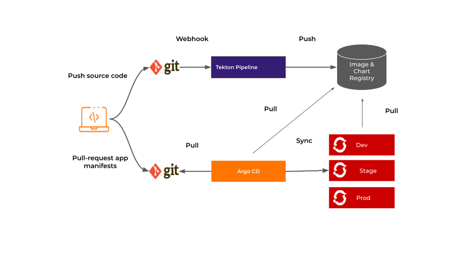
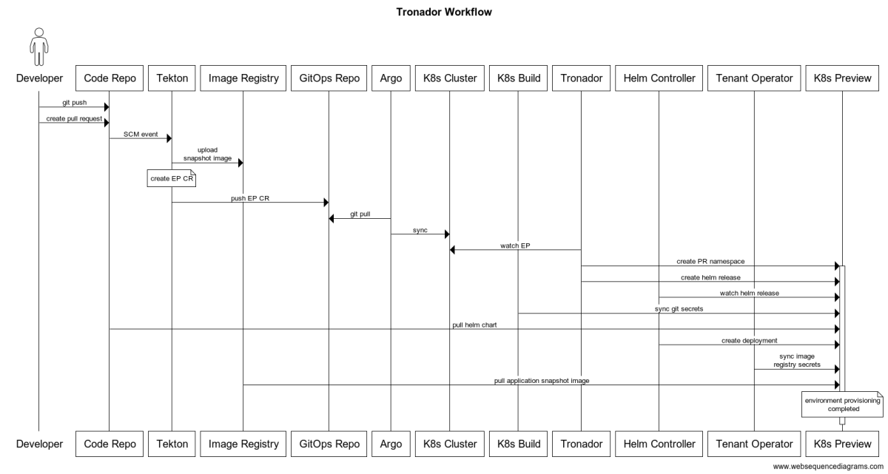
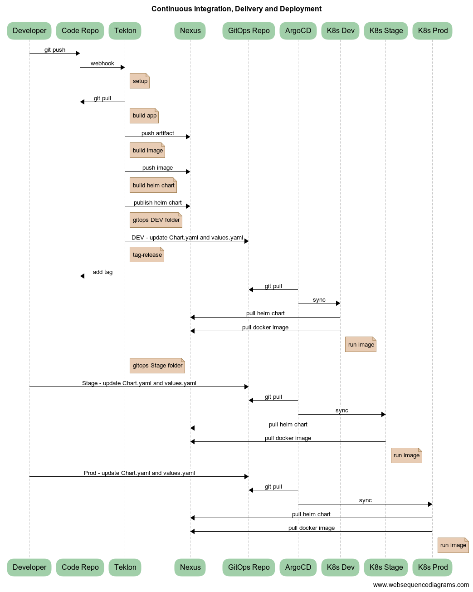
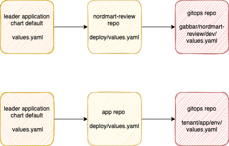
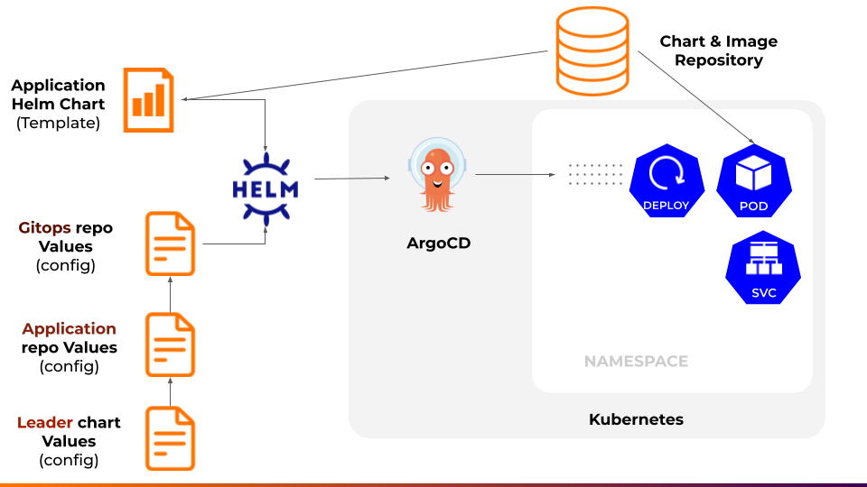
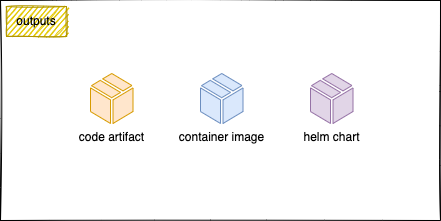
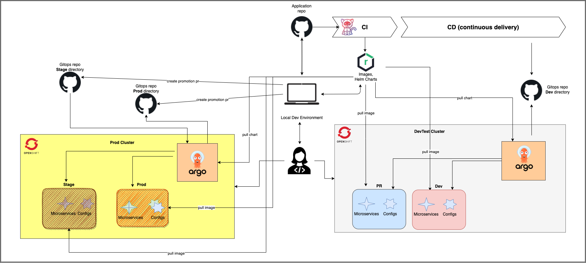
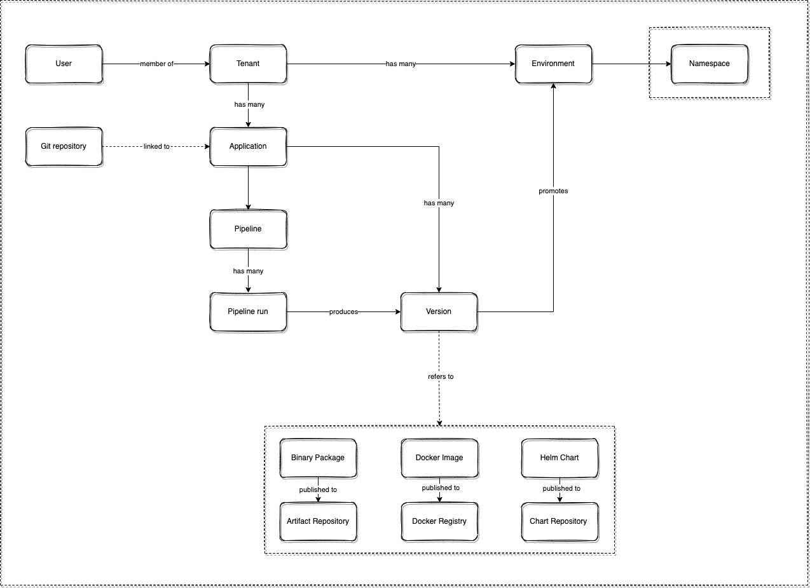
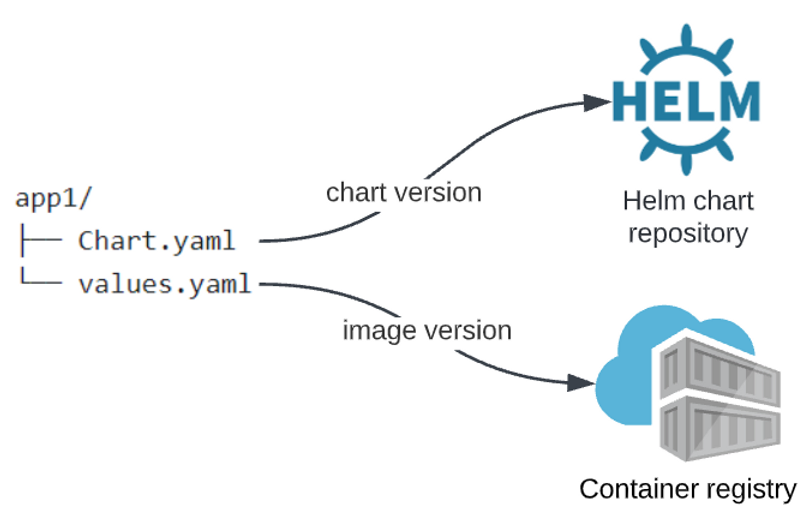

# nordmart-apps-gitops-config

Stakater opinionated gitops structure

- Mono repo
- Single branch i.e. main and then separate folders per environment
- ArgoCD for application deployment
- Helm for templatization

## Hierarchy

Tenant (Product) owns Applications which are promoted to different Environments (Static and Dynamic)

Cluster >> Tenants (teams/products) >> Applications >> Environments

A cluster can hold multiple tenants; and each tenant can hold multiple applications; and each application be deployed into multiple environments.

This gitops structure supports:

- Multiple clusters
- Multiple tenants/teams/products
- Multiple apps
- Multiple environments (both static and dynamic)

### Multiple clusters

We have 2 clusters:

1. Cluster # 1 (i.e. devtest) holds 3 environments: build, preview and dev
2. Cluster # 2 (i.e. prod) holds 2 environments: stage and prod

### Mutliple tenants

We have 2 product based tenants; who have exactly same structure

1. gabbar
2. veeru

### Multiple apps

We have 3 apps:

**Gabbar** has two apps: 

1. stakater-nordmart-review, 
2. stakater-nordmart-review-ui

**Veeru** has one app: 

1. stakater-nordmart-inventory

### Mutliple environments

We have 5 environments for each **application**:

1. build
2. preview
3. dev
4. stage
5. prod

### Naming Convention

Environment names are prefixed by a number which depends upon the order in which the application should be deployed to the environments
Cluster names follow the same convention

## Nordmart Infra Config

The cluster scoped infrastructural configurations are deployed through a separate [infra](https://github.com/stakater/nordmart-infra-gitops-config) repository.

## CI/CD/CD Workflow

### High Level Architecture

---

### CI/CD Overview

---

### Pull request workflow

---

### Main branch workflow

[CI/CD/CD](https://www.websequencediagrams.com/?lz=dGl0bGUgQ29udGludW91cyBJbnRlZ3JhdGlvbgoKcGFydGljaXBhbnQgRGV2ZWxvcGVyAAkNQ29kZSBSZXBvAB8NVGVrdG9uADINSW1hZ2UgUmVnaXN0cnkATQ1LOHMgRGV2AGENQXJ0aWZhY3RvAB0PR2l0T3BzAGASQXJnAHUOSzhzIFFBCgoAgS4JLT4AgSMJOiBnaXQgcHVzaAoAgTcJLT4AgS8GOiB3ZWJob29rCm5vdGUgcmlnaHQgb2YAgUwHOiBzZXR1cAoAgVsGAEATbGwAIRducG0gdGVzdAAEG3J1biBidWlsZFxuAAIFIGltYWdlAGMJAII0DjoAgTsFABwHAIEVFmRlcGxveVxuaGVsbSB0ZW1wbGF0ZS4uLgCBNQkAgnIHOiBvYyBhcHBseSAtZgoAgwcHAFwUAIFMEQA4CXJ1bgBuHWhlYWx0aABnEkdFVCAvABYHAIJaFnRhZy1yZWxlYXMAggAKAIM-C2FkZCB0YWcAgxYXaW0AMwoAgQEYbG0ATxEAhHILOiBwdWJsaXNoACUFIGNoYXIAgysYZ2l0b3BzAIQSCQCFHws6IHVwZGF0ZSBRQSBmb2xkZXIKQXJnbwAVDwCEOAkAFgYAhTsGOiBzeW5jCg&s=default#)

---

### Helm values override

#### Helm values override # 1

#### Helm values override # 2

---

### Outputs

The pipelines produce following outputs

---

### Release workflow

---

### Tenant, Application and Environment Mapping

---

### Using an external chart in a helm chart repository

Helm charts in GitOps repositories can be defined

- Option # 1: locally, with a templates folder including all the Kubernetes manifests or 
- Option # 2: without a templates folder using a dependency and this dependency points to an external Helm Chart Repository where your chart is located.

We prefer the later approach (option # 2); with this setup, the only configuration present in the GitOps repository is the environment-specific configuration and dependencies, based on versions. This solution scales better and has better versioning capabilities, but requires some more Helm expertise from developers.

Your resources are structured as follows:

1. For this particular environment, you define a Chart.yaml with an external dependency to a Chart Version. The Helm chart is located in a remote Helm Chart repository

2. The values.yaml for this particular environment contains all the environment-specific configuration and includes an image tag that points to a tag in the Container Registry

[Credits](https://www.pionative.com/post/how-to-manage-gitops-environments-at-scale-a-technical-guide)
